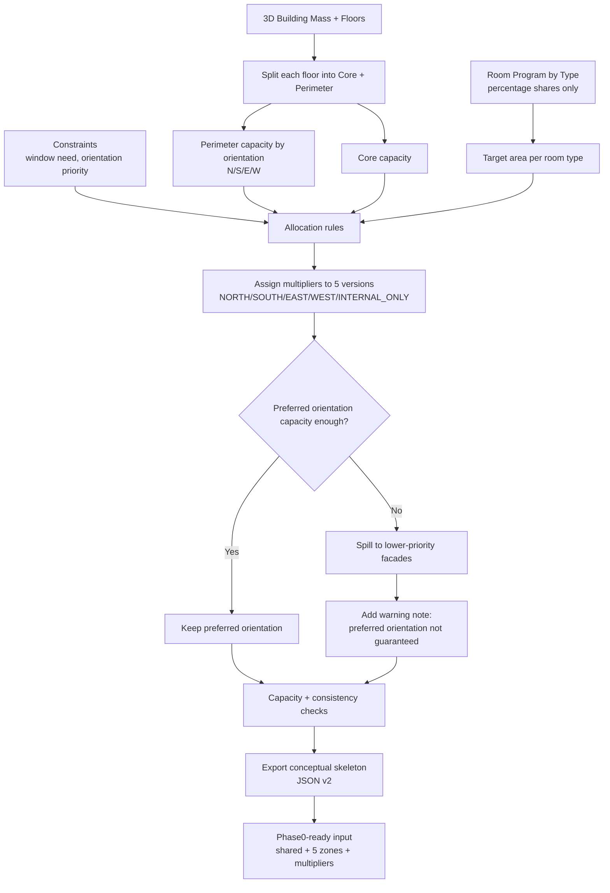

# Geometry Parametrization Plan (Conceptual Skeleton)

## Goal

Transform a 3D building mass into a conceptual zone skeleton that can drive simulation-ready inputs.

The skeleton output is based on:

- room distribution (room types + target share in building)
- orientation/window constraints
- building mass geometry

## Target Output

For each room type, produce one "typical room geometry" with 5 versions:

- `NORTH`
- `SOUTH`
- `EAST`
- `WEST`
- `INTERNAL_ONLY`

Each version gets a multiplier.  
The multiplier represents how many times that typical room appears in the conceptual building.

Examples:

- If a room type does not need windows, only `INTERNAL_ONLY` multiplier should be `> 0`.
- If a room type must face south, only `SOUTH` multiplier should be `> 0`.
- If orientation is unknown, multipliers are distributed from available space.

## Conceptual Workflow

## Visual Workflow

## 1) Inputs

- Building mass (3D): floor plate(s), height, number of floors, core assumptions.
- Room program:
  - room type id
  - share (%) or target area
  - window need (yes/no)
  - orientation preference/requirement (optional)
- Envelope priorities/constraints:
  - orientation priorities (e.g., south > east > west > north)
  - window priority rules
- Optional global constraints:
  - min/max room depth
  - min facade access ratios
  - floor efficiency targets

## 2) Normalize Building Capacity

For each floor:

- Split into:
  - **core area** (no facade access)
  - **perimeter area** (facade-accessible)
- Partition perimeter by facade orientation:
  - north, south, east, west
- Aggregate totals across floors:
  - total core capacity
  - total orientation capacities

## 3) Build Typical Room Geometry per Room Type

For each room type:

- Define one typical room geometry:
  - length, width, height
  - gross/usable area
- Generate 5 conceptual versions:
  - four perimeter versions (`N/S/E/W`)
  - one `INTERNAL_ONLY`

## 4) Allocate Multipliers

For each room type:

- Convert share/target area into required room count (or equivalent multiplier base).
- Apply constraints in order:
  1. hard constraints (must be internal, must face orientation)
  2. facade requirement (window needed -> perimeter only)
  3. preference distribution (if unknown orientation, use available capacity + priority weights)
- Compute orientation-specific multipliers under capacity limits.

## 5) Capacity and Consistency Check

- Verify allocated area does not exceed:
  - orientation perimeter capacities
  - core capacity
- Verify room program totals are met (or report deficit/surplus).
- Rebalance if needed (algorithm TBD).

## 6) Export Conceptual Skeleton

Export one compact case definition per room type containing:

- shared geometry and constructions
- 5 zone versions
- computed multipliers
- orientation WWR/window constraints

This maps naturally to the project JSON v2 schema.

## Data Model Mapping (to JSON v2)

- `case_name` -> room type case id
- `shared` -> geometry + constructions + defaults
- `zones.NORTH/SOUTH/EAST/WEST/INTERNAL_ONLY`:
  - `zone_multiplier` computed by allocation
  - `wwr_external` and window overrides by constraints

## Implementation Phases

## Phase A: Deterministic Baseline

- Rectangular floor assumption.
- Fixed core ratio per floor.
- Simple perimeter split by facade length.
- Rule-based multiplier allocation (no optimization solver).

## Phase B: Constraint-Driven Allocation

- Add weighted objective (orientation preference + facade scarcity).
- Add rebalance loop for deficits.
- Add diagnostics per room type and per orientation.

## Phase C: Geometry-General Skeleton

- Support non-rectangular floor plates.
- Multi-block buildings and irregular facades.
- Reusable skeleton adapter for different massing inputs.

## Deliverables

- Input schema for mass + room program + constraints.
- Allocation engine producing room-type x orientation multipliers.
- JSON v2 exporter for Phase0 pipeline.
- Validation report:
  - fulfilled vs unfulfilled program
  - perimeter/core usage
  - orientation utilization

## Open Questions (Need Your Decisions)

1. Room shares: should input be primarily `% of gross area`, absolute `m2`, or both?
2. Core split: do you want a fixed core ratio per floor, or core geometry provided explicitly?
3. Orientation capacity: should capacity be based on facade length, facade area, or both?
4. Multiplier type: can multipliers be fractional, or must they be integers?
5. Priority handling: when constraints conflict, should unmet demand be:
   - moved to lower-priority orientations,
   - moved to internal zones,
   - or reported as unallocated?
6. Window requirement: do you want binary (`requires window`) or graded (`preferred` vs `required`)?
7. Multi-floor strategy: should allocation be done floor-by-floor first, or globally for the whole building?
